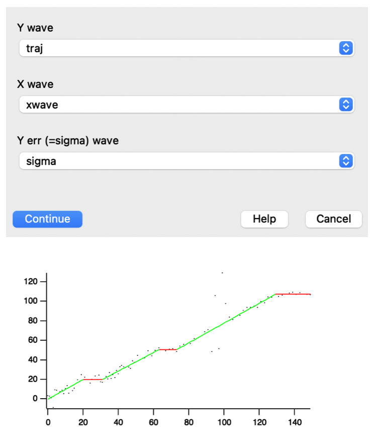

* Find Pauses

This is a toolbox to find pauses in translocation trajectories.

** Installation

This toolbox requires Igor Pro 8 to run.
Copy the content of this repository to Igor's User Procedures folder and follow the instructions below.

** Usage of the dialog

To start with a dialog, select the Analysis -> Find Pauses menu.

*Y wave:*	A wave containing the trajectory
*X wave:*	(optional) A wave containing the x (or time) values of the trajectory
*Y err wave:*	(optional) A wave containing the errors \(\sigma_{t}\) of the trajectory

If no Y err wave is provided, σ is assumed to be constant and estimated from the trajectory.

The results will be displayed in a new window, and the results will be printed in the command window.

For a demonstration, load the data contained in the subfolder /demodata/ and set the dialog as shown below. The ground truth is also provided in the same folder.

** Manual use

The functions ~FindPausesMCMC~ and ~FindPausesMCMC_MT~ in /FindPauses.ipf/ both provide direct access to the pause finding core functions, for scripting. The _MT version is multi-threaded and faster.

Parameters for these functions are:
~Wave traj [,Variable maxCountsSinceLastBest, Variable noiseSigma, Wave xwave, Variable randomseed, Wave sigmaWave, Variable Nruns, Variable quiet]~

*traj:*	Y trajectory wave
*xwave:* 	(optional) If provided, a wave containing the x (or time) values of the trajectory
*randomseed:*	(optional) A number to initializing the random number generator, to provide reproducible results. Mostly used for debugging
*sigmaWave:*	(optional) Wave of point-wise errors \(\sigma_{t}\)
*noiseSigma:*	(optional) Fixed-value noise value
*Nruns:*	(optional) Number of independent fits done. Defaults to the number of processors.
*maxCountsSinceLastBest:*	(optional) Stopping criterion. If no better solution is found for this many steps, stop the computation.
*quiet:*	(optional) Suppress outputs to the console.

The parameters /sigmaWave/ and /noiseSigma/ are mutally exclusive. Either provide a fixed-value noise parameter, or a point-wise noise value. If neither is provided, the noise is estimated from the trajectory.

The outputs will be stored ~in root:Packages:FindPauses~. This includes ~W_Pauses~: A wave containing the indices of the start and duration of detected pauses and ~bestfit~: a wave of the best fit (which needs to be plotted against ~xwave~, if xwave was provided). The variable ~redchisq~ provides the reduced chi-square of the fit residuals, which should be close to one. This is mostly used for quality-control when providing external noise parameters via ~sigmaWave~ or ~noiseSigma~. The flag ~v_isStatic~ is set to one if the entire trajectory is found to be non-moving.
